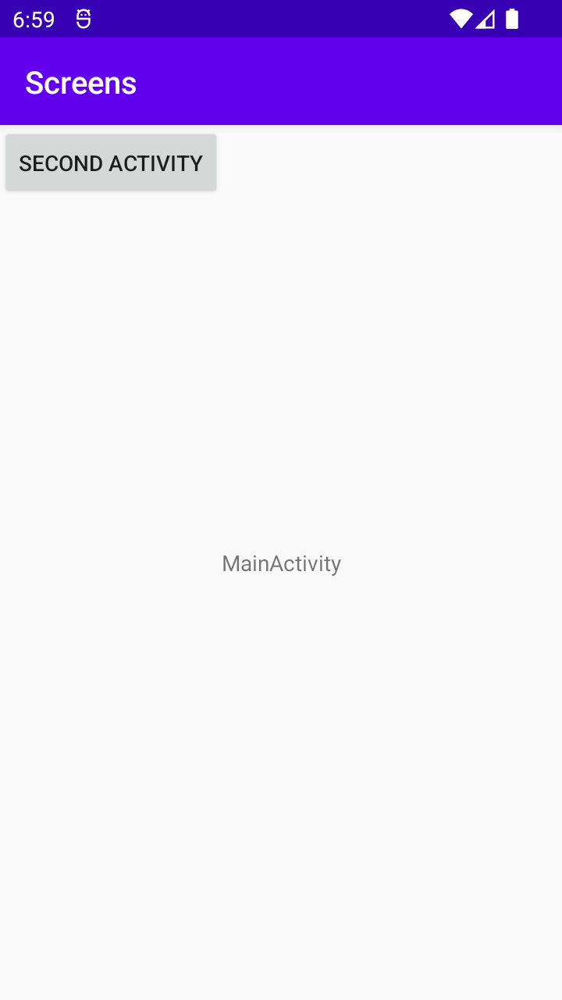
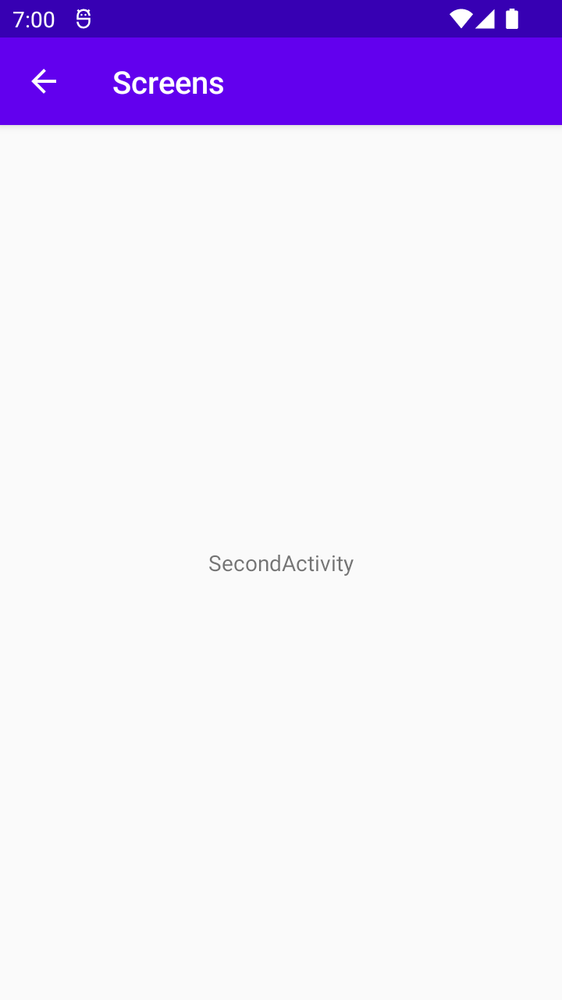

# Rapport

Uppgiften har varit att skapa en ny aktivitet. Det har skapats en button i den första aktiviteten som kopplades till den andra aktiviteten. Det skapades ett id för knappen i activity_main.xml som användes för att skapa en variabel som är kopplad till en onclicklistener som exekverar en kod när knappen trycks ner. Detta görs med en intent och sedan på andra aktiviteten tas det emot en bundle av innehållet som skickades med extras eller intent från första aktiviteten.

```
//activitymain
Button b = findViewById(R.id.mainBtn);
b.setOnClickListener(new View.OnClickListener() {
            @Override
            public void onClick(View view) {
                Log.d("==>","Vi har klickat");
                Intent second = new Intent(MainActivity.this, SecondActivity.class);
                second.putExtra("text", "SecondActivity");
                startActivity(second);
            }
        });
//activitysecond
Bundle extras = getIntent().getExtras();
        if (extras != null) {
            String name = extras.getString("text");
            Log.d("==>","Vi har skickat value: " + name);
            TextView text = findViewById(R.id.textname);
            text.setText(name);
        }
```


